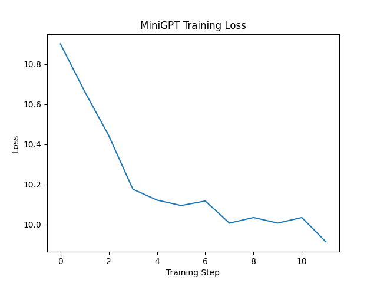
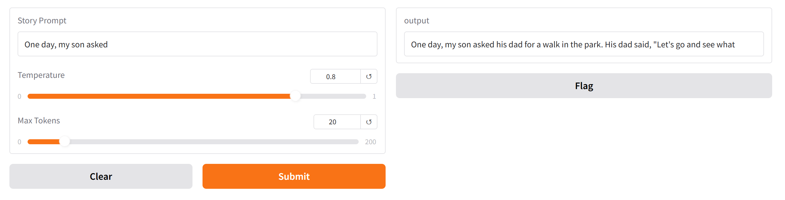

## Features

### Transformer Language Model

- Decoder-only Transformer architecture inspired by GPT models
- Token and positional embeddings
- Stacked Transformer blocks implemented with Flax NNX
- Multi-head self-attention mechanism
- Causal attention masking for autoregressive generation
- Residual skip connections around attention outputs
- Linear output projection for next-token prediction

The current implementation focuses on understanding the core components of GPT-style language models, including attention, masking, token prediction, and the complete LLM development workflow using JAX.

---

### Training Pipeline

- Custom training loop implemented with JAX
- Automatic differentiation using JAX
- Optimization using Optax AdamW
- Learning rate scheduling
- Loss monitoring
- Model checkpointing and restoration using Orbax

---

### Data Pipeline

- GPT-2 BPE tokenizer using `tiktoken`
- Efficient batching using Grain
- Configurable dataset loading pipeline

---

### Inference Pipeline

- Restore models from Orbax checkpoints
- Automatic checkpoint retrieval from Hugging Face Hub
- Generate text using autoregressive decoding
- Compare trained and pretrained models using identical prompts
- Interactive text generation interface using Gradio

---

## Architecture

The model follows a decoder-only Transformer architecture:

```text
Input Token IDs
        |
        v
Token + Position Embeddings
        |
        v
+-----------------------------+
|      Transformer Blocks     |
|                             |
|  Multi-Head Self-Attention  |
|             |               |
|             v               |
|   Residual Connection       |
|  (x + attention output)     |
|                             |
+-----------------------------+
        |
        v
Linear Output Projection
        |
        v
Vocabulary Logits
        |
        v
Next Token Prediction
```

Each Transformer block currently contains:

- Multi-head self-attention
- Causal attention masking for autoregressive prediction
- Residual connection around the attention output

The causal mask ensures that each token can only attend to previous tokens and itself, following the autoregressive design used by GPT-style language models.

---

## Results

The model was trained on a small subset of the TinyStories dataset to validate the complete LLM training workflow.

The current model configuration is intentionally small to demonstrate the complete development lifecycle, including training, checkpointing, inference, and deployment preparation.

Training included:

- Tokenization using GPT-2 BPE tokenizer
- Batch generation using Grain
- Optimization using Optax AdamW
- Checkpoint saving and restoration using Orbax

### Text Generation Example

The following examples compare generation from the trained MiniGPT model and a pretrained MiniGPT model using the same prompt.

**Prompt**

```text
Once upon a time
```

### Trained MiniGPT

```text
Once upon a time,,,,,,,,,,,,,,,,,,,,,,,,,,,,,,,,,,,,,,,,,,,,,,,,,,
```

### Pretrained MiniGPT

```text
Once upon a time, there was a little girl named Lily. She loved to play outside in the sunshine. One day, she saw a big, scary dog. The dog was barking and running towards her. Lily was scared and ran away.
But then, she...
```

The comparison demonstrates the difference between a small model trained on limited data and a pretrained language model trained on larger-scale datasets.

---

## Training Loss

The training loss decreased during optimization, demonstrating successful parameter updates and learning behavior.



---

## Model Checkpoints

The trained model checkpoints are hosted on Hugging Face to keep this repository lightweight.

Download the checkpoints from the Hugging Face Hub:

**MiniGPT-JAX Model Repository**

https://huggingface.co/FatimaAlloush/MiniGPT-JAX

The checkpoints are automatically downloaded when running the inference pipeline.

The expected checkpoint structure is:

```text
checkpoints/
├── pretrained_checkpoint.orbax
└── trained_small_checkpoint.orbax
```

---

## Interactive Demo

The project includes a Gradio interface for interactive text generation.

The demo allows users to:

- Provide a text prompt
- Generate text from the model
- Experiment with generation parameters

### Running Locally

Install dependencies and run:

```bash
python -m inference.run_inference
```

The interface will be available locally:

```text
http://127.0.0.1:7860
```

### Gradio Interface

The model can be tested through an interactive web interface:



---

## Running with Docker

The project includes a Dockerized inference environment to provide a reproducible setup for running the MiniGPT-JAX application.

### Build the Docker Image

From the project root:

```bash
docker build -t minigpt-jax .
```

### Run the Container

Launch the Gradio interface:

```bash
docker run -p 7860:7860 minigpt-jax
```

The application will be available at:

```text
http://localhost:7860
```

The Docker workflow automatically:

- Installs project dependencies
- Creates a reproducible runtime environment
- Downloads model checkpoints from Hugging Face Hub
- Restores Orbax checkpoints
- Launches the Gradio inference interface

To stop a running container:

```bash
docker ps
docker stop <container_id>
```

---

## Future Improvements

Planned improvements include:

### Model Improvements

- Add feed-forward (MLP) layers and layer normalization
- Train on larger datasets
- Increase model size and training duration
- Improve text generation strategies using top-k and top-p sampling

### Deployment and MLOps

- Deploy inference service using FastAPI
- Add cloud deployment workflow
- Implement production-ready model serving
- Add CI/CD pipeline for automated testing and deployment

---

## Technologies

| Component | Technology |
|---|---|
| Language | Python |
| Numerical Computing | JAX |
| Neural Network Framework | Flax NNX |
| Optimization | Optax |
| Data Pipeline | Grain |
| Checkpointing | Orbax |
| Tokenization | tiktoken |
| Model Hosting | Hugging Face Hub |
| Demo Interface | Gradio |
| Containerization | Docker |